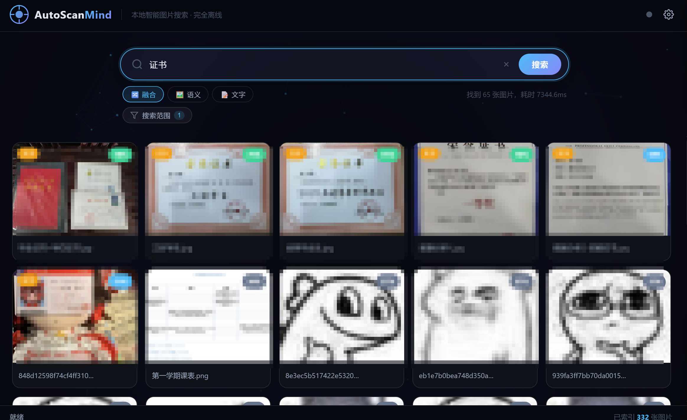
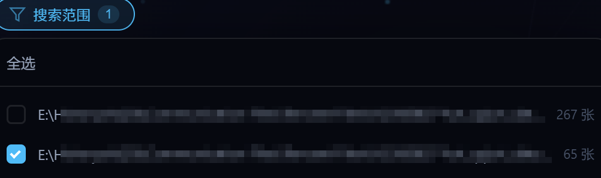
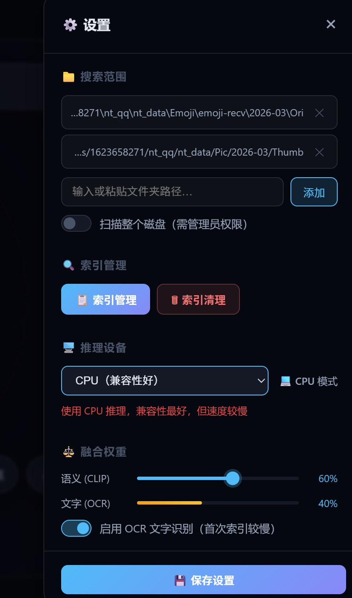
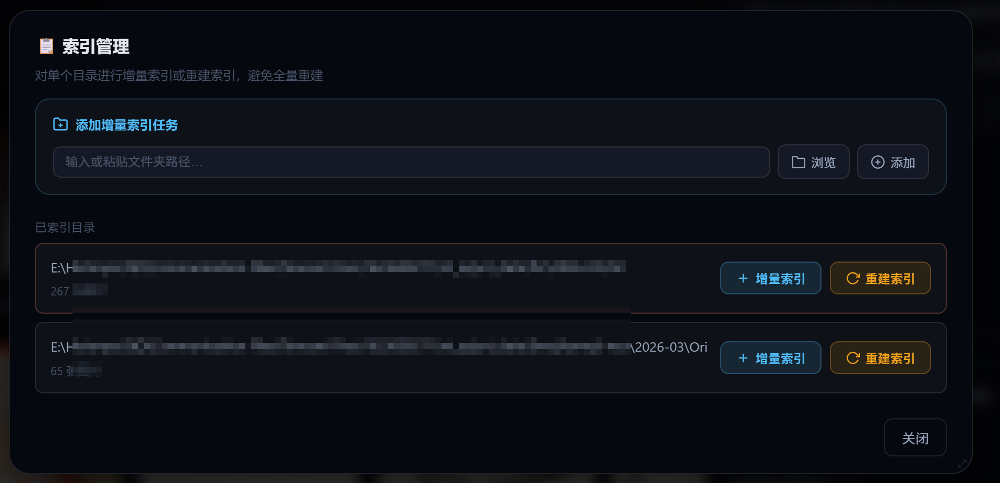
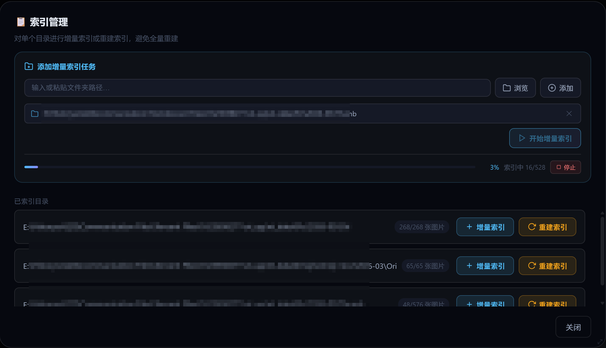
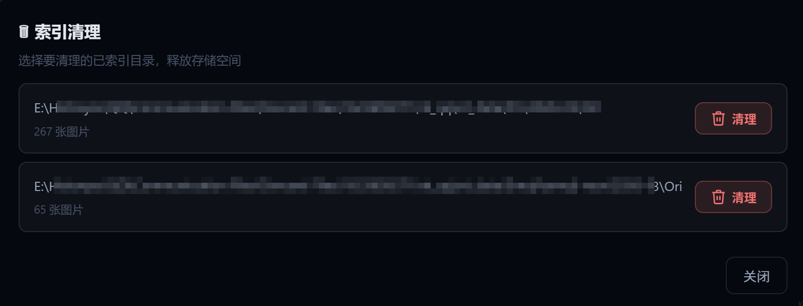

# AutoScanMind

> **本地智能图片搜索工具** — 融合 CLIP 语义理解与 PaddleOCR 文字识别，完全离线运行

[](https://www.python.org/)
[](LICENSE)
[](https://www.microsoft.com/windows)

---

## 界面预览

### 主界面 — 自然语言搜索

<!-- 图片：主界面搜索结果展示，搜索框输入关键词后显示结果网格 -->


主界面采用玻璃拟态深色主题，搜索框居中置顶，输入自然语言即可搜索。结果以网格形式展示，hover 查看文件路径，点击可打开文件或所在目录。

### 搜索模式切换

<!-- 图片：展示融合/语义/文字三种搜索模式 -->


支持三种搜索模式：
- **🔀 融合模式**（默认）：CLIP 语义 + OCR 文字双路加权融合，综合排序
- **🖼️ 语义模式**：纯 CLIP 视觉语义搜索，适合按画面内容查找
- **📝 文字模式**：纯 OCR 文字搜索，适合查找截图、文档扫描件中的文字

### 搜索范围筛选

<!-- 图片：搜索栏下方的目录筛选器下拉效果 -->


配置多个扫描目录后，搜索栏下方自动出现「搜索范围」筛选器，支持全选/单选，默认搜索已配置的目录。

### 设置面板

<!-- 图片：右侧滑出的设置面板，包含搜索范围、索引管理、融合权重等选项 -->


点击右上角 ⚙️ 按钮打开设置面板，可管理：
- **📁 搜索范围**：添加/移除要扫描的文件夹路径，或启用全盘扫描
- **🔍 索引管理**：打开索引管理弹窗，对单个目录进行增量索引或重建
- **🗑 索引清理**：清理指定目录的索引数据，释放存储空间
- **⚖️ 融合权重**：调节 CLIP 语义与 OCR 文字的融合比例，双击数字可精确输入

### 索引管理

<!-- 图片：索引管理弹窗，显示已索引目录列表和增量索引任务队列 -->


索引管理弹窗支持：
- 添加目录到增量索引队列，批量提交扫描
- 对已索引目录单独执行**增量索引**（仅扫描新文件）或**重建索引**
- 实时进度条显示索引进度，可随时停止

### 增量索引进行中

<!-- 图片：索引管理弹窗中执行增量索引时，显示实时进度条和红色停止按钮 -->


点击「开始增量索引」后，弹窗内显示实时进度条和当前索引的文件信息：
- 进度百分比和已索引文件数 / 总文件数
- 红色**停止**按钮可随时中断索引，已索引的部分会保留
- 索引完成后自动刷新目录列表，toast 提示完成路径
- 即使关闭弹窗，后台索引仍会继续；重新打开弹窗时可恢复进度显示

### 索引清理

<!-- 图片：索引清理弹窗，显示已索引目录列表，每个目录有红色删除按钮 -->


当某些目录不再需要搜索时，可通过索引清理弹窗释放存储空间：
- 在设置面板点击「🗑 索引清理」打开清理弹窗
- 列出所有已索引的目录及其文件数量
- 点击目录旁的**清理**按钮，删除该目录的所有索引数据（FAISS 向量、OCR 文字、缩略图等）
- 清理操作不可撤销，请确认后再执行

### 图片预览

<!-- 图片：点击搜索结果卡片后的图片预览弹窗，显示 OCR 识别文字和文件信息 -->


点击搜索结果卡片打开预览弹窗，可查看：
- 图片大图预览
- CLIP/OCR 各自匹配概率（语义 XX% · 文字 XX%）
- OCR 识别出的文字内容
- 快捷操作：打开文件 / 打开所在目录

---

## 功能特性

- **自然语言搜索**：输入"猫"、"合同"、"海边日落"，同时匹配图像视觉内容（CLIP）与图片内嵌文字（PaddleOCR）
- **双路融合检索**：CLIP 语义相似度 + BM25 文字匹配，加权融合排序，找到视觉和文字双维度最相关的图片
- **三种搜索模式**：融合 / 纯语义 / 纯文字，按需切换
- **灵活搜索范围**：支持指定单个/多个文件夹，或扫描整个磁盘
- **增量索引更新**：仅重新索引变化的文件，避免全量重建，节省时间
- **单目录索引管理**：对每个目录独立进行增量索引或重建，支持任务队列
- **完全离线运行**：所有模型本地加载，无需网络和付费 API，保障隐私
- **现代化界面**：基于 pywebview 的玻璃拟态深色主题桌面 GUI，动态粒子背景

## 技术栈

| 组件 | 技术 |
|------|------|
| 桌面 GUI | pywebview 5.x + HTML/CSS/JS |
| 语义搜索 | Chinese-CLIP ViT-L/14 (本地模型) |
| 向量索引 | FAISS (faiss-cpu) |
| OCR 识别 | PaddleOCR (中英文) |
| 文字检索 | BM25 (rank_bm25) |
| 后端服务 | FastAPI + uvicorn |
| 数据库 | SQLite (WAL 模式) |
| 缩略图 | Pillow |
| 文件监控 | watchdog |

## 架构说明

```
┌─────────────────────────────────────────────────┐
│                  前端 (HTML/JS/CSS)               │
│          pywebview WebView2 渲染                 │
├──────────────────────┬──────────────────────────┤
│    API 路由层        │       引擎层              │
│  ┌─────────────┐    │   ┌──────────────────┐    │
│  │ search.py   │    │   │ CLIPEngine       │    │
│  │ files.py    │───▶│   │ OCREngine        │    │
│  │ settings.py │    │   │ FAISSStore       │    │
│  │ index.py    │    │   │ IndexManager     │    │
│  └─────────────┘    │   │ MetadataDB       │    │
│                      │   └──────────────────┘    │
├──────────────────────┴──────────────────────────┤
│              FastAPI + uvicorn                   │
│              (127.0.0.1:18765)                   │
├─────────────────────────────────────────────────┤
│     SQLite (WAL)  │  FAISS 索引  │  文件系统     │
└─────────────────────────────────────────────────┘
```

- **API 路由层**（`backend/api/`）：接收前端请求，参数校验，调用引擎层
- **引擎层**（`backend/engine/`）：核心业务逻辑，所有组件均为线程安全单例
- **数据层**：SQLite 存储元数据和 OCR 文字，FAISS 存储向量索引，文件系统存储缩略图

## 快速开始

### 环境要求

- Python 3.10+
- Windows 10/11
- 内存 >= 4GB（建议 8GB 以上，ViT-L 模型约 1.2GB）

### 安装

```bash
# 克隆项目
git clone https://github.com/yourname/autoscanmind.git
cd autoscanmind

# 创建虚拟环境
python -m venv venv
venv\Scripts\activate

# 安装依赖
pip install -r requirements.txt
```

### 模型准备

将以下模型文件放置到对应目录：

```
backend/models/
├── chinese-clip-vit-large-patch14/   # Chinese-CLIP ViT-L/14 模型
│   ├── config.json
│   ├── pytorch_model.bin (或 model.safetensors)
│   └── ...
└── paddleocr/                         # PaddleOCR 模型
    ├── det/                           # 检测模型
    ├── rec/                           # 识别模型
    └── cls/                           # 方向分类模型
```

首次运行时 PaddleOCR 会自动下载模型到 `backend/models/paddleocr/` 目录。CLIP 模型需手动下载放置（约 1.2GB）。

PaddleOCR下载地址：
CLIP模型下载地址：https://huggingface.co/OFA-Sys/chinese-clip-vit-large-patch14/tree/main

### 首次运行

```bash
python main.py
```

### 打包为 .exe

```bash
build.bat
```

打包产物在 `dist/AutoScanMind/` 目录，可直接分发。

## 项目结构

```
autoscanmind/
├── main.py                 # 程序入口 (pywebview + FastAPI)
├── config.py               # 全局配置
├── requirements.txt        # Python 依赖
├── build.bat               # PyInstaller 打包脚本
├── autoscanmind.spec       # PyInstaller 配置
├── backend/
│   ├── app.py              # FastAPI 应用
│   ├── api/                # API 路由层
│   │   ├── search.py       # 搜索接口
│   │   ├── files.py        # 文件/目录接口
│   │   ├── settings.py     # 设置接口
│   │   └── index.py        # 索引管理接口
│   ├── engine/             # 核心引擎层
│   │   ├── clip_engine.py  # CLIP 语义编码
│   │   ├── ocr_engine.py   # PaddleOCR 文字识别
│   │   ├── faiss_store.py  # FAISS 向量存储/检索
│   │   ├── index_manager.py# 索引构建/管理
│   │   └── metadata_db.py  # SQLite 元数据库
│   ├── models/             # 本地模型文件
│   └── static_files.py     # 前端静态文件服务（no-cache）
├── frontend/
│   ├── index.html          # 主界面
│   ├── css/style.css       # 玻璃拟态深色主题样式
│   └── js/
│       ├── app.js          # 主界面交互逻辑
│       └── settings.js     # 设置面板交互逻辑
├── data/                   # 运行时数据（自动生成）
│   ├── metadata.db         # SQLite 元数据库
│   ├── faiss.index         # FAISS 向量索引
│   ├── faiss_id_map.json   # 索引 ID 映射
│   ├── text_index.json     # BM25 文字索引
│   ├── settings.json       # 用户设置
│   ├── thumbnails/         # 缩略图缓存
│   └── logs/               # 运行日志
└── docs/
    └── images/             # README 截图
```

## 使用说明

### 1. 添加扫描目录

打开设置面板（⚙️），在「搜索范围」中添加需要扫描的文件夹路径，点击「保存设置」。保存后若有未索引的新目录，会自动触发增量索引。

### 2. 等待索引完成

索引过程中底部状态栏显示进度，主界面会显示半透明遮罩阻止搜索。也可在「索引管理」弹窗中查看详细进度，支持随时停止。

### 3. 搜索图片

在搜索框输入自然语言，按回车或点击搜索按钮。支持中英文搜索，例如：
- `猫咪` / `cat` — 按视觉内容搜索
- `合同` / `contract` — 按图片中的文字搜索
- `海边日落` — 融合模式同时匹配视觉和文字

### 4. 查看与管理结果

- **hover 卡片**：查看文件路径和 CLIP/OCR 匹配概率
- **点击卡片**：打开图片预览弹窗，查看 OCR 文字和文件信息
- **打开文件**：直接在系统默认程序中打开图片
- **打开目录**：在资源管理器中定位到图片所在文件夹

### 5. 调整搜索策略

- **切换搜索模式**：搜索框下方切换 融合/语义/文字 模式
- **调整融合权重**：设置面板中拖动滑块或双击数字精确输入
- **缩小搜索范围**：使用搜索栏下方的目录筛选器

## 配置说明

编辑 `config.py` 可调整：

| 配置项 | 说明 | 默认值 |
|--------|------|--------|
| `CLIP_MODEL_NAME` | CLIP 模型路径 | 本地 ViT-L/14 |
| `CLIP_DEVICE` | 推理设备 | `"cpu"` |
| `CLIP_BATCH_SIZE` | 批量推理大小 | `8` |
| `FAISS_DIM` | 向量维度 | `768` (ViT-L) |
| `FAISS_TOP_K` | FAISS 候选集大小 | `50` |
| `DEFAULT_ALPHA` | CLIP 融合权重 | `0.6` |
| `DEFAULT_TOP_N` | 搜索返回数量上限 | `1000` |
| `SUPPORTED_EXTENSIONS` | 支持的图片格式 | jpg/png/bmp/webp/tiff/gif/heic |
| `SCAN_EXCLUDE_DIRS` | 扫描排除的目录名 | Windows/System32/node_modules 等 |

## License

[MIT License](LICENSE)

## 致谢

- [Chinese-CLIP](https://github.com/OFA-Sys/Chinese-CLIP) — 中文图文预训练模型
- [PaddleOCR](https://github.com/PaddlePaddle/PaddleOCR) — 中英文 OCR 识别
- [FAISS](https://github.com/facebookresearch/faiss) — 高效向量检索
- [pywebview](https://pywebview.flowrl.com/) — 轻量级桌面 GUI
- [FastAPI](https://fastapi.tiangolo.com/) — 高性能 Web 框架
